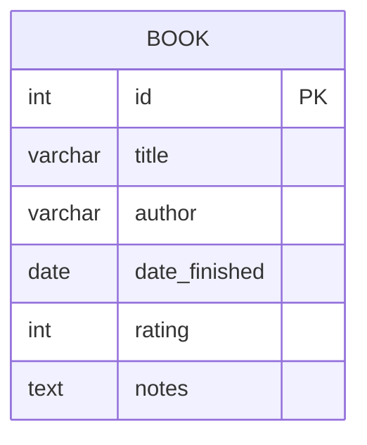
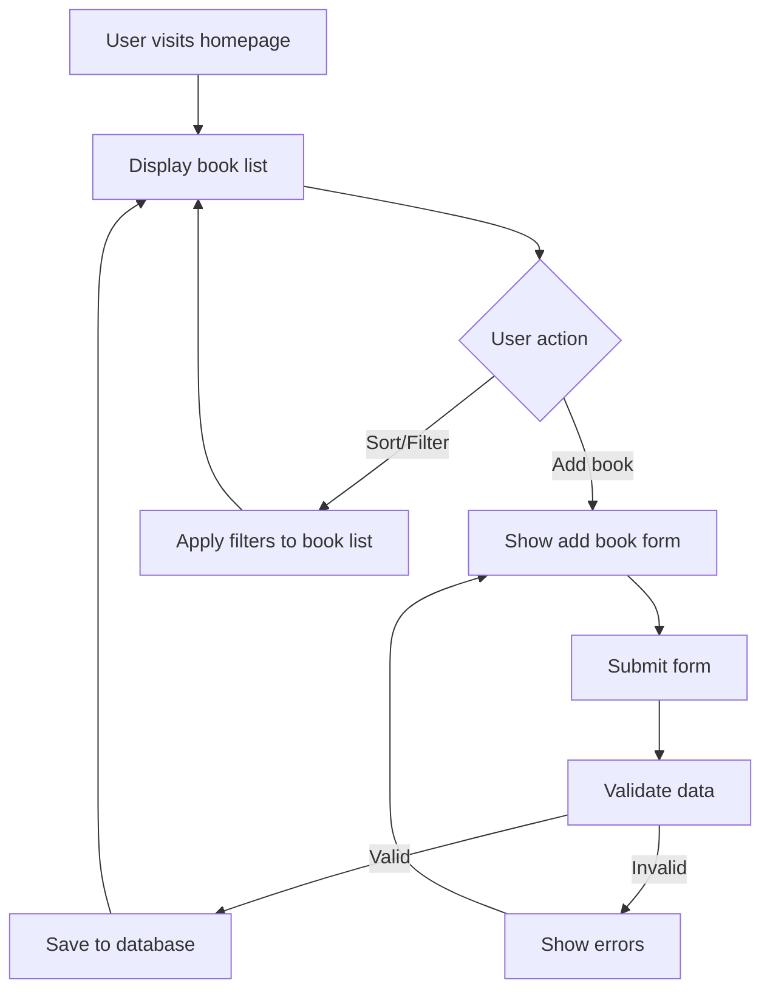

# Reader Diary - Django Application Architecture Summary

## Project Overview
A web application built with Python Django to store and manage information about read books. Users can view their reading history, add new books, and filter/sort the book list.

## Technology Stack
- Backend: Python Django
- Database: MySQL
- Frontend: HTML, CSS, Django Templates

## Key Components

### 1. Data Model
**Book Model Fields:**
- Title (CharField, max_length=200)
- Author (CharField, max_length=100)
- Date Finished (DateField)
- Rating (IntegerField, 1-5 scale)
- Notes (TextField, optional)

### 2. Views
- **BookListView**: Displays books with sorting/filtering capabilities
- **AddBookView**: Handles form for adding new books
- **BookDetailView** (Optional): Shows details of a specific book

### 3. Forms
- **BookForm**: Django form for adding/editing books with validation

### 4. URL Structure
- `/` - Homepage showing list of books
- `/add/` - Form to add a new book
- `/book/<id>/` - View details of a specific book (optional)

### 5. Templates
- **base.html**: Base template with common structure
- **book_list.html**: Displays book list with filtering options
- **add_book.html**: Form for adding new books

### 6. Static Files
- **style.css**: Main stylesheet with responsive design

## Features Implemented

### View List of Read Books
- Table display of all books
- All relevant information shown (title, author, date finished, rating, notes)

### Sort and Filter Books
- Sorting by title, author, date finished, rating (both ascending and descending)
- Filtering by author, rating range, date range

### Add New Book
- Form with validation for all required fields
- Date picker for date finished
- Star rating selector

## Database Schema


## Application Structure
```
reader_diary/
├── manage.py
├── reader_diary/
│   ├── __init__.py
│   ├── settings.py
│   ├── urls.py
│   ├── wsgi.py
│   └── asgi.py
├── books/
│   ├── __init__.py
│   ├── models.py
│   ├── views.py
│   ├── urls.py
│   ├── forms.py
│   ├── templates/
│   │   └── books/
│   │       ├── book_list.html
│   │       └── add_book.html
│   └── migrations/
├── static/
│   └── css/
│       └── style.css
└── templates/
    └── base.html
```

## Workflow


## Requirements
- Python 3.8+
- Django 4.2+
- MySQL database
- mysqlclient package

## Installation
1. Create virtual environment
2. Install dependencies from requirements.txt
3. Configure database settings
4. Run migrations
5. Create superuser
6. Run development server

This architecture provides a solid foundation for a functional reading diary application with room for future enhancements.